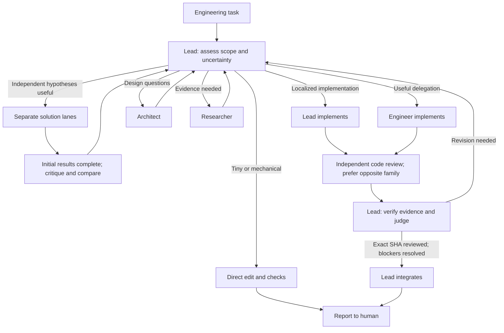

# Multi-AI

**Orca is the mechanism. Multi-AI is the policy.** Install this skill in an Orca
project, then give Codex or Claude Code the task: "Fix this bug" or "Investigate
this performance regression and fix it." No orchestration prompt or worker
commands are needed from the user.

[SKILL.md](SKILL.md) owns shared rules; [policy.yaml](policy.yaml) owns model routes.
Roles, prompts and schemas supply details only when needed. Orca owns processes,
terminals, worktrees, tasks, messages and persistence. There is no orchestration runtime.

## How it works



Paths are choices, not worker counts. The Lead creates every Orca worker.
Architect covers structure and tradeoffs; Researcher gathers evidence and hypotheses.
SKILL.md defines review and integration requirements, including Lead-authored code.

## Install in a target project

Run from the **target repository root on its execution host**, with working GitHub
credentials for this private source. Use the existing [skills CLI](https://github.com/vercel-labs/skills),
also used by Orca's bundled-skill installer. Node/npx is installation tooling;
the installed skill has no package dependency.

```sh
npx --yes skills add https://github.com/hyunyul-XCENA/multi-ai/tree/dev --skill multi-ai --agent codex claude-code --yes
npx --yes skills list --agent codex claude-code
```

Project scope is the default. The CLI installs `.agents/skills/multi-ai/` and exposes
it under `.claude/skills/multi-ai/` for Claude, managing links/copies and skills-lock.json.
Review and commit the installed files and project guidance so Orca child worktrees
and teammates receive them. Windows may use a junction/copy; verify both locations
when checking out on another host.

Without Node, copy SKILL.md, policy.yaml, roles/, prompts/ and schemas/ into both
skill directories. Maintain both copies together. No script is needed to use them;
the CLI is recommended for maintaining one canonical installation.

## Activate for ordinary requests

Add this small section to the target's **AGENTS.md**, preserving other instructions:

```markdown
For non-trivial engineering work, consult the installed multi-ai skill and choose
the smallest useful workflow. Handle tiny edits directly. An active Orca worker
Dispatch retains its assigned role and scope; it must not start a team.
```

For Claude, add `@AGENTS.md` to **CLAUDE.md** if it does not already import it.
[Codex](https://learn.chatgpt.com/docs/build-skills) discovers `.agents/skills`;
[Claude](https://code.claude.com/docs/en/skills) uses `.claude/skills` and
[CLAUDE.md imports](https://code.claude.com/docs/en/memory#agentsmd). Both can select
skills from their descriptions; project guidance makes the intended use explicit.
Discovery is not a deterministic enforcement gate.

Start your usual Codex or Claude session in the target Orca workspace and give
only the task. Saved Lead prompts can be shortened. Set Lead model/effort when
launching; a skill cannot change an existing session's model or permissions.
Explicit `$multi-ai` (Codex) or `/multi-ai` (Claude) remains available.

Verify the project path in Codex `/skills` or Claude's skill list. Restart after
adding project instructions. Check behavior during real work; no paid demo is needed:

| Task alone | Expected decision |
| --- | --- |
| "Fix this typo in README." | [SIMPLE](examples/simple.md): direct edit and checks. |
| "Add input validation to this API and regression tests." | [NORMAL](examples/normal.md): delegate if useful; independently review the behavior change. |
| "The CUDA path is intermittently 30% slower. Find the cause and fix it." | [HARD](examples/hard-competition.md): consider independent hypotheses, benchmark, then implement and review. |

## Update and remove

Update in the target repository:

```sh
npx --yes skills update multi-ai --project --yes
```

To remove the project installation:

```sh
npx --yes skills remove multi-ai --yes
```

Review updates in Git, including any project-specific policy.yaml changes. Removal
also needs you to remove the Multi-AI routing paragraph; retain other project
instructions/imports. Remove any saved invocation or recovery-profile option you
no longer use. Manual-copy installations update/remove both copies.
For local-source CLI installs, update by repeating the original add command;
skills 1.5.26's update command skips local sources.

For an old personal installation, remove `--profile multi-ai` from its launcher
before running `npx --yes skills remove multi-ai --global --yes`. Install at project
scope to avoid duplicate discovery or personal Claude skill precedence. The old
install.ps1/install.sh skill-registration workflow is replaced by the skills CLI.

## Routing and remote work

Model preferences remain in policy.yaml. Every worker receives explicit native
`--agent`, `--model` and `--effort` options. Review prefers the opposite maker family;
if those routes are unavailable, same_family_fallback permits a fresh independent
checker with the limitation recorded. Remove that fallback or require cross-family
coverage in the task to make it mandatory. Model availability is account-specific.

NORMAL/HARD guide judgment; CRITICAL deepens verification rather than maximizing
agents. For SSH projects, installation, builds, tests and benchmarks run on the
workspace's execution host. Paths and reports are not automatically shared across
hosts. Use Orca's installed placement guide for remote dispatch.

Checked against Orca 1.4.202, Codex 0.154.0 and skills CLI 1.5.26. Native guides remain
authoritative as tools change. No host scheduler or provider adapter is added.

## Optional Codex recovery reminder

Normal activation needs no profile or hook. CLI installations include the optional
profile scripts: run `./install.ps1` (Windows) or `sh install.sh` (POSIX) from the
installed skill directory to opt in. These scripts
only write multi-ai.config.toml under CODEX_HOME (default ~/.codex); they register
no skill, launch no worker and change no model or permission settings.

Add `--profile multi-ai` to that project's Codex launcher. Review/trust the native
hook in `/hooks`, then start a new session. It prints [recover.md](prompts/recover.md)
on startup/resume/compact with a 400 approximate-token limit. Policy re-reads still
consume context. See native [hooks](https://learn.chatgpt.com/docs/hooks) and
[profiles](https://learn.chatgpt.com/docs/config-file/config-advanced#profiles).

The profile points at the installation that generated it; use it with that project.
It does not propagate automatically to workers or Claude. Re-runs accept only
identical profile content. To relocate/migrate an old generated profile, disable
its launcher option, inspect and remove only that profile, regenerate and trust
its new definition. Base config and other hooks remain untouched.

## Contracts and limits

Workers write JSON reports referenced by native worker_done --report-path. Schemas
describe structure; the Lead verifies identity, snapshots and evidence. Use available
JSON tooling and native CLI help for structural checks; these cannot prove behavior.

No daemon, HTTP/REST server, FastAPI, dashboard, database/SQLite, Redis, MCP server,
generic DAG engine, terminal/worktree manager, process supervisor, session database,
chat bus, plugin framework, provider SDK, quota/budget manager, Telegram/Slack,
Gemini/OpenCode, Kubernetes or recursive teams. No Docker, WSL or extra service.
