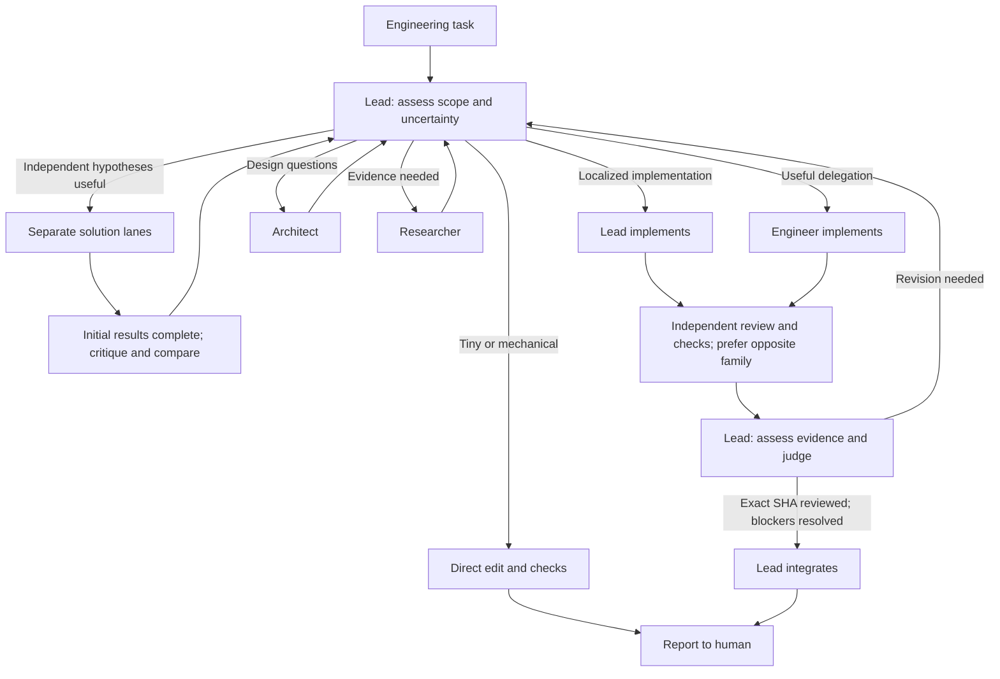

# Multi-AI

**Orca is the mechanism. Multi-AI is the policy.** Install once on the host
where your Orca agents run, then give Codex or Claude Code the task: "Fix this bug"
or "Investigate this performance regression and fix it." No orchestration prompt or worker
commands are needed from the user.

[SKILL.md](SKILL.md) owns shared rules; [policy.yaml](policy.yaml) owns model routes.
Roles, prompts and schemas supply details only when needed. Orca owns processes,
terminals, worktrees, tasks, messages and persistence. There is no orchestration runtime.

## How it works



Paths are choices, not worker counts. The Lead creates every Orca worker.
Architect covers structure and tradeoffs; Researcher gathers evidence and hypotheses.
SKILL.md defines review and integration requirements, including Lead-authored code.

## Install once per host

Clone this private repository using your GitHub credentials:

```sh
git clone --branch dev https://github.com/hyunyul-XCENA/multi-ai.git
cd multi-ai
```

On Windows / PowerShell:

```powershell
./install.ps1
```

On Linux/macOS or an SSH host:

```sh
sh ./install.sh
```

Both scripts call the existing [skills CLI](https://github.com/vercel-labs/skills)
with `--global`, `--skill multi-ai` and `--agent codex claude-code`. The CLI manages
installation; the scripts contain no skill-copy or worker-launch implementation.
Node/npx and GitHub access are needed for installation; Node also runs the optional
configuration CLI and its YAML parser. Agent orchestration itself has no Multi-AI
runtime. A failed skill or CLI install stops the script. Re-running refreshes the
global installation. By default, the installer also creates a host-local Codex
execution rule for the detected Orca executable.

Codex discovers `~/.agents/skills/multi-ai/`; Claude uses `~/.claude/skills/multi-ai/`.
This covers all projects for that user on that host. Run once on Windows for local
projects and once on each remote execution host; Windows installation is not remote
installation. No project-by-project installation or recurring prompt is needed.

### Codex approval for Orca orchestration

The installer writes `multi-ai.rules` under `CODEX_HOME/rules` (normally
`~/.codex/rules`) and validates it with
`codex execpolicy check` when Codex is on PATH. The rule binds to the detected,
absolute Orca executable and allows its entire `orca orchestration` namespace,
including `dispatch`, `worker-stop`, `worker-abandon` and `reset`.
Other commands still follow the normal Codex approval policy. Restart Codex after
installation so the new rule is loaded.

Inspect, regenerate or remove only this managed rule with:

```sh
multi-ai-cli codex-rules show
multi-ai-cli codex-rules install
multi-ai-cli codex-rules remove
```

Pass the executable explicitly if automatic detection is wrong, for example
`multi-ai-cli codex-rules install /home/me/.orca-relay/bin/orca`. Re-run the
installer on each execution host because its Orca path and Codex home are local to
that host. Use `./install.ps1 -SkipCodexOrcaRules` or
`sh ./install.sh --skip-codex-orca-rules` to leave Codex rules unchanged.

### Configure routing on one host

The installer also registers `multi-ai-cli` through npm's global bin. It can edit
Lead, Architect, Engineer, Researcher, both maker-family Reviewer routes,
competition lanes and revision rounds. It stores only values that differ from the
installed policy outside the skill, so updates do not erase local choices and
unchanged settings continue to receive new defaults. Open the full terminal UI with:

```sh
multi-ai-cli tui
```

The TUI derives its model choices from the installed policy and current overrides.
Choose an agent, model and effort from menus; you do not need to remember or type a
model ID. Use `Esc` or `q` to return one step; at the root they exit without saving.
Direct `set` remains available for deliberately testing a new identifier.

Every TUI screen shows what a route is set to right now. Role menus list each route
as `agent / model / effort` and mark the ones that differ from the installed policy
with `*`; the route editor prints Current, Default and Editing in its header and tags
the agent, model and effort you are on with `<- current` and `<- default`. Role menus
and the route editor both offer a restore entry that stages the installed default.

### Resolve a route before dispatch

The Lead resolves each launch with `route`, which merges the installed policy with
the host overrides and prints the flags for one `worker-start`:

```sh
multi-ai-cli route architect
# --agent claude --model claude-fable-5-1 --effort medium

orca orchestration worker-start $(multi-ai-cli route engineer) --role engineer
```

Because it reads the policy from disk on every call, editing the policy mid-session
reaches the next worker. Reviewer routes are keyed by the family that wrote the
change, so they need `--maker-family`.

`route` resolves; it never decides availability. A provider that is rate-limited or
down only shows up when `worker-start` fails, so stepping down the ladder stays the
Lead's call after a confirmed failure. Ask for a rung with `--step`, and see what a
family outage leaves with `--ladder`:

```sh
multi-ai-cli route reviewer --maker-family anthropic --ladder
# primary               --agent codex --model gpt-6-astra --effort high
# fallback              --agent codex --model gpt-5.6-sol --effort high
# same_family_fallback  --agent claude --model claude-fable-5-1 --effort medium   # same family as the maker
```

A rung that is not the primary, or that puts the reviewer in the maker's own family,
prints what must be disclosed. Those warnings go to stderr, so command substitution
still captures only the flags:

```sh
multi-ai-cli route reviewer --maker-family anthropic --step same_family_fallback
# --agent claude --model claude-fable-5-1 --effort medium
# ...and on stderr:
# # Not the primary route. Use it only after confirmed unavailability, and record the substitution.
# # Same family as the maker. Cross-family review independence is lost.
# # Record the reduced diversity in the review and in the decision.
```

Use `--json` for the full resolution, including the policy paths it came from, to
record launch provenance with the Task.

### Inspect and change values directly

Or inspect and change any supported policy leaf directly:

```sh
multi-ai-cli show
multi-ai-cli get roles.engineer.primary.model
multi-ai-cli set roles.engineer.primary.agent claude
multi-ai-cli set roles.engineer.primary.model claude-opus-5
multi-ai-cli set roles.engineer.primary.effort high
```

To go back to what the installed policy ships, `unset` takes a single value or any
path above one, so a whole route, role or section restores in one command:

```sh
multi-ai-cli unset roles.engineer.primary.model   # one value
multi-ai-cli unset roles.engineer.primary         # agent, model and effort
multi-ai-cli unset roles.engineer                 # both Engineer routes
multi-ai-cli unset competition                    # both competition lanes
multi-ai-cli reset                                # every installed default
```

`diff` lists everything that differs from the installed policy, and `defaults` prints
what the installed policy ships:

```sh
multi-ai-cli diff
multi-ai-cli defaults
multi-ai-cli defaults roles.architect
```

The existing family shortcut remains available:

```sh
multi-ai-cli engineer claude
```

It swaps the installed Engineer primary/fallback routes so the requested family is
preferred. Use `engineer default` to restore those routes, or `multi-ai-cli reset`
to restore the entire installed policy. Commands write only `~/.multi-ai/policy.yaml`;
set
`MULTI_AI_CONFIG_HOME` to put that file elsewhere. Start a new Lead session after
changing Lead routing; active sessions cannot change their own model. Other routing
changes can be picked up by asking an existing Lead to re-read the host policy.
If the command is not found, ensure npm's global bin is on PATH and rerun the installer.
Provider families remain limited to the Codex and Claude agents supported by this V1.

For an intentionally project-scoped copy, use the CLI directly from the target root:

```sh
npx --yes skills add https://github.com/hyunyul-XCENA/multi-ai/tree/dev --skill multi-ai --agent codex claude-code --yes
```

That creates `.agents/skills/multi-ai/`, the Claude entry and skills-lock.json.
Commit those files if the project should distribute the skill. Prefer one scope to
avoid duplicate discovery or personal Claude skill precedence. To switch an existing
project copy to global, remove the project copy with `npx skills remove multi-ai --yes`
from that project, then run the global installer.

Without Node, copy SKILL.md, policy.yaml, roles/, prompts/ and schemas/ into both
user skill directories. Maintain both copies together; no script is needed to use them.

## Activate for ordinary requests

For consistent automatic use, add this once to Codex's **CODEX_HOME/AGENTS.md**
(default `~/.codex/AGENTS.md`) and Claude's **~/.claude/CLAUDE.md**, preserving other
instructions. These are user-level files on the execution host:

```markdown
For non-trivial engineering work, consult the installed multi-ai skill and choose
the smallest useful workflow. Handle tiny edits directly. An active Orca worker
Dispatch retains its assigned role and scope; it must not start a team.
```

For project-specific activation instead, use the project's AGENTS.md and import it
with `@AGENTS.md` from its CLAUDE.md.
[Codex](https://learn.chatgpt.com/docs/build-skills) discovers `.agents/skills`;
[Claude](https://code.claude.com/docs/en/skills) uses `.claude/skills` and
[CLAUDE.md imports](https://code.claude.com/docs/en/memory#agentsmd). Both can select
skills from their descriptions; the short routing instruction makes intended use explicit.
Discovery is not a deterministic enforcement gate.

Start your usual Codex or Claude session in the target Orca workspace and give
only the task. Saved Lead prompts can be shortened. Set Lead model/effort when
launching; a skill cannot change an existing session's model or permissions.
Explicit `$multi-ai` (Codex) or `/multi-ai` (Claude) remains available.

Verify the global path in Codex `/skills` or Claude's skill list, or run
`npx skills list --global --agent codex claude-code`. Restart after adding instructions.
Check behavior during real work; no paid demo is needed:

| Task alone | Expected decision |
| --- | --- |
| "Fix this typo in README." | [SIMPLE](examples/simple.md): direct edit and checks. |
| "Add input validation to this API and regression tests." | [NORMAL](examples/normal.md): delegate if useful; independently review the behavior change. |
| "The CUDA path is intermittently 30% slower. Find the cause and fix it." | [HARD](examples/hard-competition.md): consider independent hypotheses, benchmark, then implement and review. |

## Orca setup

Install and activate the skill above before saving the launcher. Orca needs no
special "Lead" role setting; the user-facing session follows the installed policy.

In Orca's Codex agent settings, set **default arguments** to `--approve-for-me`.
Replace any previous `--dangerously-bypass-approvals-and-sandbox` argument.
Automatic approval review uses Codex's workspace-write sandbox; it can still reject
an action. Keep model/effort choices out of these shared defaults: the Lead launcher
and each worker's native dispatch select them explicitly.

In **Quick Commands**, add and save:

| Field | Value |
| --- | --- |
| Name | `Multi-AI lead` |
| Action | **Terminal Command** (shown as **Terminal**) |
| Scope, under Advanced | **Global** |
| Append Enter | **On** |

Use this command, matching the current `lead.primary` in policy.yaml:

```sh
codex --approve-for-me --model gpt-6-astra -c model_reasoning_effort=xhigh
```

A Terminal Command supplies its own launch arguments, so include the permission
option here too. Update this saved command if you change the Lead model or effort
in policy.yaml. After installing the [optional recovery profile](#optional-codex-recovery-reminder)
on the same execution host and Codex configuration home, add `--profile multi-ai`
to the command and trust the hook once through `/hooks`. No initial orchestration
prompt is needed after activation.

For a new task, create a worktree under the intended Orca project, or open the
checkout you intend to use. Open a **Blank Terminal**, right-click **inside that
terminal**, and choose **Quick Commands → Multi-AI lead**. Codex starts in that
terminal; enter only your engineering task. Running the command from the **tab-bar
Quick Commands button** creates another tab, leaving the blank terminal open.

Global commands saved in this Orca client are available in its local and remote
workspace menus; you do not need a separate command for each SSH project. They run
in the selected workspace's terminal. The skill, Codex/Claude installation, login
and optional recovery profile must exist on that execution host. If a command is
missing, check its Global scope and which Orca client/profile saved it; Global does
not synchronize settings to a different Orca installation.

## Update and remove

In the source clone, run `git pull --ff-only`, then re-run `./install.ps1` or
`sh ./install.sh`. The scripts refresh the published global skill through the CLI.
Host overrides under `~/.multi-ai/` survive updates; direct edits inside the
installed skill do not.

To remove the global installation:

```sh
multi-ai-cli codex-rules remove
npm uninstall --global multi-ai-cli
npx --yes skills remove multi-ai --global --yes
```

Remove the Multi-AI routing paragraph from your user instructions and any saved
invocation/profile option; preserve unrelated content. Remove only the generated
multi-ai.config.toml if you installed the optional profile. For project-scoped
installations use `npx skills update multi-ai --project --yes` or remove without
`--global`. Local-source CLI installations update by repeating their add command;
skills 1.5.26 skips them in update. Manual-copy installations maintain both copies.
The host policy is deliberately retained for a later reinstall; delete only
`~/.multi-ai/policy.yaml` if you also want to remove those overrides.

## Routing and remote work

Model preferences remain in policy.yaml. Every worker receives explicit native
`--agent`, `--model` and `--effort` options. Review prefers the opposite maker family;
if those routes are unavailable, same_family_fallback permits a fresh independent
checker with the limitation recorded. Remove that fallback or require cross-family
coverage in the task to make it mandatory. Model availability is account-specific.

NORMAL/HARD guide judgment; CRITICAL deepens verification rather than maximizing
agents. For SSH projects, installation, builds, tests and benchmarks run on the
workspace's execution host. Paths and reports are not automatically shared across
hosts. Use Orca's installed placement guide for remote dispatch.

Checked against Orca 1.4.202, Codex 0.154.0 and skills CLI 1.5.26. Native guides remain
authoritative as tools change. No host scheduler or provider adapter is added.

## Optional Codex recovery reminder

The default installer adds only the dedicated Orca execution rule described above.
To also create the recovery profile, use `./install.ps1 -RecoveryProfile` or
`sh ./install.sh --recovery-profile`. Both still perform the global skill install.
The profile is written under CODEX_HOME (default ~/.codex) and references the global
skill's [recover.md](prompts/recover.md), so it can be used across projects on this host.
Models, permissions and base configuration are unchanged.

Add `--profile multi-ai` to your Codex launcher. Review/trust the native hook in
`/hooks`, then start a new session. It injects a short reminder at startup/resume/compact
with a 400 approximate-token limit; policy re-reads still consume context. See native
[hooks](https://learn.chatgpt.com/docs/hooks) and
[profiles](https://learn.chatgpt.com/docs/config-file/config-advanced#profiles).

The hook does not automatically propagate to workers or Claude. Profile creation
accepts only identical existing content. To replace an older generated profile,
disable its launcher option, inspect and remove only that profile, regenerate and
trust its new definition. Ordinary installation does not touch an existing profile.

## Contracts and limits

Workers write JSON reports referenced by native worker_done --report-path. Schemas
describe structure; the Lead verifies identity, snapshots and evidence. Use available
JSON tooling and native CLI help for structural checks; these cannot prove behavior.

No daemon, HTTP/REST server, FastAPI, dashboard, database/SQLite, Redis, MCP server,
generic DAG engine, terminal/worktree manager, process supervisor, session database,
chat bus, plugin framework, provider SDK, quota/budget manager, Telegram/Slack,
Gemini/OpenCode, Kubernetes or recursive teams. No Docker, WSL or extra service.
