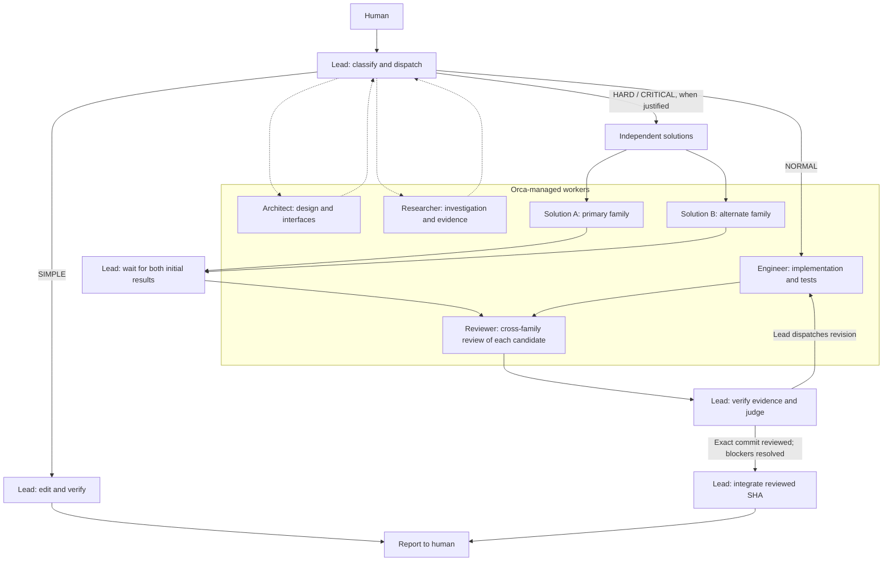

# Multi-AI

A small intelligence policy on top of Orca: **Policy -> Orca**.
Orca owns processes, terminals, worktrees, tasks, messaging and persistence.
This repository supplies instructions and result contracts, with no orchestration
runtime or package dependencies. Installers register skill links and an optional
native Codex recovery profile.

The Lead decomposes, dispatches, verifies, judges and integrates.
The five roles are [Lead](roles/lead.md),
[Architect](roles/architect.md), [Engineer](roles/engineer.md),
[Researcher](roles/researcher.md) and [Reviewer](roles/reviewer.md); the Lead's
judge phase is not another worker. The authoritative rules and routing levels
are in [SKILL.md](SKILL.md).

[SIMPLE](examples/simple.md) demonstrates direct work;
[NORMAL](examples/normal.md) demonstrates implementation and independent review;
[HARD](examples/hard-competition.md) demonstrates isolated competitors.
CRITICAL adds investigation only when a specific risk justifies it.

## How it works



Arrows show work flowing between steps; the Lead dispatches every worker through
Orca. Dotted paths are optional investigation. Model and effort choices come from
[policy.yaml](policy.yaml).

## Use and configuration

Clone this private repository on the machine where the agents run, using your
GitHub credentials. Keep the clone in a stable location:

```sh
git clone --branch dev https://github.com/hyunyul-XCENA/multi-ai.git
cd multi-ai
```

On Windows / PowerShell, run [install.ps1](install.ps1):

```powershell
.\install.ps1
```

On Linux/macOS, including an SSH host, run [install.sh](install.sh):

```sh
sh ./install.sh
```

The installers link this clone into `~/.agents/skills/multi-ai` for Codex and
`~/.claude/skills/multi-ai` for Claude, following their
[Codex](https://developers.openai.com/codex/skills/) and
[Claude](https://code.claude.com/docs/en/skills#where-skills-live) discovery rules.
Windows uses directory junctions without administrator rights; POSIX uses symlinks.
Reruns accept matching links/profile content and refuse to replace differing files
or links. They install no agents or dependencies and change no permissions or
model settings. `git pull --ff-only` updates the linked skill and recovery text.
Rerun the installer to add the recovery profile to an older installation.

Start a new Lead session in Orca, in the **target project's** checkout. Invoke
`$multi-ai` in Codex or `/multi-ai` in Claude, followed by the task. Without
installation, ask the Lead to read this SKILL.md by absolute path instead.
Use the Lead route in [policy.yaml](policy.yaml) when launching; reading the file
does not change an existing session's model.

### Recovery after long sessions

The installer writes `multi-ai.config.toml` to `CODEX_HOME` (default `~/.codex`)
from [codex-profile.toml](codex-profile.toml). It adds a native `SessionStart` hook
for `startup`, `resume` and `compact`, printing only [recover.md](prompts/recover.md)
and the installed skill path. It launches no model, parses no transcript, and
stores no session state. The agent re-reads policy and recovers actual Orca state;
this is a reminder, not an enforced review/merge gate.

Add `--profile multi-ai` once to your saved Codex Lead command, keeping its
explicit model/effort and `--approve-for-me` options. The existing `$multi-ai`
prompt can stay saved there. In the first session, open `/hooks`, review and trust
this hook, then start a new session. Codex skips untrusted or disabled hooks;
the installer neither enables disabled hooks nor bypasses trust. See the native
[hook trust](https://learn.chatgpt.com/docs/hooks#review-and-trust-hooks) and
[profile](https://learn.chatgpt.com/docs/config-file/config-advanced#profiles) rules.

Only Codex sessions launched with this profile receive the hook. It does not
automatically propagate to Orca workers or Claude; they follow the recovery rule
in SKILL.md. The reminder preserves the assigned role if a worker explicitly uses
the profile. Keep model routing in policy.yaml. To stop using the hook, remove
`--profile multi-ai` from that launcher.

For a free config-load check in PowerShell, run
`codex --profile multi-ai debug prompt-input | Out-Null` after installation
(use `> /dev/null` in a POSIX shell). This renders context without a model call;
it does not execute or trust hooks. Inspect `/hooks` in an idle session for one Multi-AI
SessionStart entry with the three sources above; no per-tool or per-prompt hook.
The output limit is 400 approximate tokens; subsequent policy reads still use
input tokens. Actual compaction delivery can be checked during the next real task.

For Orca SSH projects, install on the remote execution host, where Orca's CLI
connection and the configured Codex/Claude launchers must already work. Local
Windows installation does not register the skill remotely or copy credentials.
Prefer Lead and workers on that host; consult the installed Orca placement guide
for cross-server dispatch. Source and report files must remain accessible to the
Lead. The examples use PowerShell syntax; use the host's shell and paths on Linux.
Orca 1.4.202's `skills install` installs its bundled guides, not this repository.

policy.yaml centralizes explicit agent/model/effort choices, role-specific
fallbacks and opposite-family reviewer routes. The Lead passes those choices
directly to native worker-start. It is human/agent guidance, not an Orca config
file or a provider adapter. Configure agent execution permissions in Orca.

Inspected with Orca **1.4.202**, Codex **0.154.0**, Claude Code **2.1.268** on
Windows / PowerShell. Codex IDs/efforts were checked in its local model cache;
Claude IDs in Orca's bundled catalog and Claude's interface. Account availability
was not tested with paid calls. The conservative Claude pins use locally
recognized versions, with explicit fallbacks. Model context:
[OpenAI](https://developers.openai.com/api/docs/models),
[Claude](https://code.claude.com/docs/en/model-config).

## Contracts and checks

Each worker writes a small JSON report referenced by native worker_done
--report-path. The Lead reads that file and independently verifies its claims.
Schemas describe structure, not a sandbox or an automatically enforced merge gate.

For a lightweight local check, parse each schema with PowerShell
`Get-Content -Raw <schema-path> | ConvertFrom-Json` and use PowerShell 7
`Test-Json -SchemaFile <schema-path>` against a report. Inspect the diff, local
links and examples, and compare commands with the installed Orca help.
No worker launch is needed to validate documentation.

## Intentional limits

No daemon, HTTP/REST server, FastAPI, dashboard, database/SQLite, Redis, MCP server,
generic DAG engine, terminal/worktree manager, process supervisor, persistent
session database, chat bus, plugin framework, provider SDK layer, quota/budget
manager, Telegram/Slack integration, Gemini/OpenCode, Kubernetes or recursive
agent organizations. No Docker, WSL, extra service or custom merge machinery.
